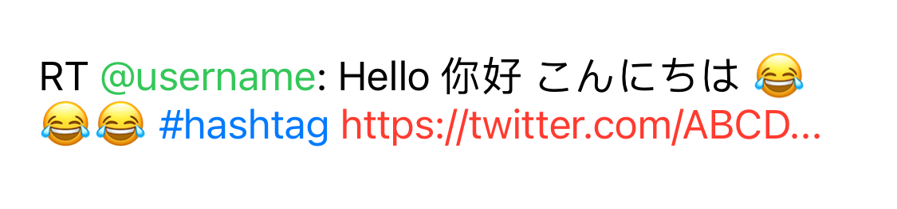

# ActiveLabel.swift 

UILabel drop-in replacement supporting Hashtags (#), Mentions (@), URLs (http://), Emails, written in Swift

## Features

* Swift 5.0 (1.1.0+) and 4.2 (1.0.1)
* Default support for **Hashtags, Mentions, Links, Emails**
* Ability to trim urls
* Super easy to use and lightweight
* Works as `UILabel` drop-in replacement
* Design for works with [twitter-text](https://github.com/twitter/twitter-text)

## Install (iOS 13+)

### Swift Package Manager

Add package path: `https://github.com/TwidereProject/ActiveLabel.swift` to your Xcode - Project - Swift Packages settings

## Demo

You can find the demo App works with twitter-text [here](https://github.com/TwidereProject/ActiveLabel.swift-Demo).

## Alternatives

Before writing `ActiveLabel` we've tried a lot of the following alternatives but weren't quite satisfied with the quality level or ease of usage, so we decided to contribute our own solution.

* [TTTAttributedLabel](https://github.com/TTTAttributedLabel/TTTAttributedLabel) (ObjC) - A drop-in replacement for UILabel that supports attributes, data detectors, links, and more
* [STTweetLabel](https://github.com/SebastienThiebaud/STTweetLabel) (ObjC) - A UILabel with #hashtag @handle and links tappable
* [AMAttributedHighlightLabel](https://github.com/rootd/AMAttributedHighlightLabel) (ObjC) - A UILabel subclass with mention/hashtag/link highlighting
* [KILabel](https://github.com/Krelborn/KILabel) (ObjC) - A simple to use drop in replacement for UILabel for iOS 7 and above that highlights links such as URLs, twitter style usernames and hashtags and makes them touchable
